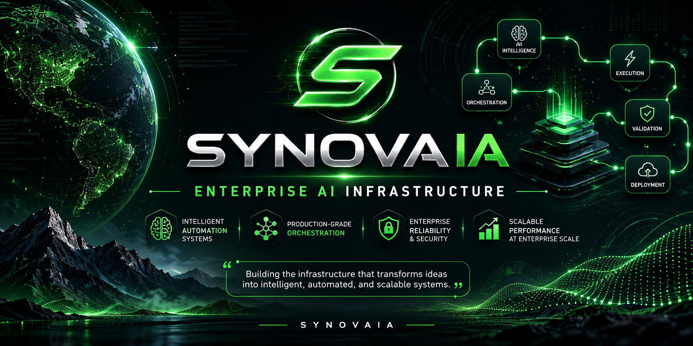

  

# SynovaIA

**Enterprise Intelligent Infrastructure**

Designing enterprise AI infrastructure, intelligent automation systems, and production-grade orchestration architectures.

---

## Executive Overview

SynovaIA builds intelligent infrastructure for enterprises requiring operational excellence, scalable automation, and production-grade AI systems.

We transform operational complexity into structured, reliable, and intelligent architectures capable of supporting mission-critical workloads at scale.

Our focus: enterprise-ready AI infrastructure, intelligent orchestration platforms, and production automation systems engineered for reliability, governance, and scalability.

---

## Enterprise Capabilities

### Intelligent Automation Systems
- Enterprise workflow orchestration
- Multi-stage automation pipelines
- Real-time processing architectures
- Production-grade system integrations
- Automated decision frameworks

### Architecture Engineering
- Structural validation systems
- Technical consistency frameworks
- System architecture analysis
- Production blueprint generation
- Deployment optimization

### Edge Intelligence & Distributed Systems
- Real-time vision processing
- Distributed edge deployments
- Smart monitoring infrastructures
- IoT integration frameworks
- Edge-to-cloud architectures

### Infrastructure Platforms
- Enterprise API ecosystems
- Scalable data architectures
- Realtime synchronization systems
- Distributed caching layers
- Containerized execution environments
- Resilient pipeline orchestration

### Security & Operational Reliability
- System integrity validation
- Comprehensive observability
- Fault-tolerant architectures
- Idempotent execution models
- Secure workflow enforcement
- Production hardening protocols

---

## Intelligent Infrastructure Philosophy

Infrastructure must be invisible, reliable, and scalable.

We engineer systems that operate with precision under load, maintain consistency across distributed environments, and provide deterministic behavior in complex operational contexts.

Our approach prioritizes:
- **Architectural clarity** over ad-hoc solutions
- **Operational determinism** over experimental patterns
- **Production resilience** over rapid iteration
- **Enterprise governance** over unconstrained flexibility

---

## Operational Reliability

Production systems demand engineering discipline.

Our infrastructure is designed around core reliability principles:
- Deterministic execution under variable load
- Graceful degradation during partial failures
- Automatic recovery without manual intervention
- Consistent state management across distributed nodes
- Predictable latency characteristics

Reliability is not a feature—it is the foundation.

---

## AI Governance Principles

Intelligent systems require structured governance.

We implement:
- Audit-capable execution trails
- Policy-enforced workflow boundaries
- Validated transformation pipelines
- Controlled automation scopes
- Compliance-aligned architecture patterns

Governance enables scale without sacrificing control.

---

## Enterprise Integration Readiness

Enterprise environments demand seamless integration.

Our systems are engineered for:
- Heterogeneous technology ecosystems
- Legacy system interoperability
- Multi-cloud deployment models
- Hybrid infrastructure topologies
- Standardized interface contracts

Integration is architectural, not adhesive.

---

## Security & Compliance Positioning

Security is embedded at the architectural layer.

We enforce:
- Defense-in-depth principles
- Zero-trust execution models
- Encrypted data transit and persistence
- Role-based access control frameworks
- Audit-ready logging architectures

Compliance is designed in, not bolted on.

---

## Scalability Philosophy

Scale is a consequence of sound architecture.

We design for:
- Horizontal expansion without re-architecture
- Load distribution without coordination bottlenecks
- State partitioning without consistency loss
- Resource elasticity without operational overhead

Scalability emerges from structural integrity.

---

## SynovaIA Vision

We are building the infrastructure layer for intelligent enterprise operations.

Our mission: enable organizations to deploy AI-driven automation with confidence, governed by engineering rigor and designed for production reality.

**From architecture to execution — engineered for enterprise.**

---

## Leadership

**Smtih Soto**  
Founder & Chief Architect @ SynovaIA

*Designing enterprise AI infrastructure for production-grade intelligent systems.*
